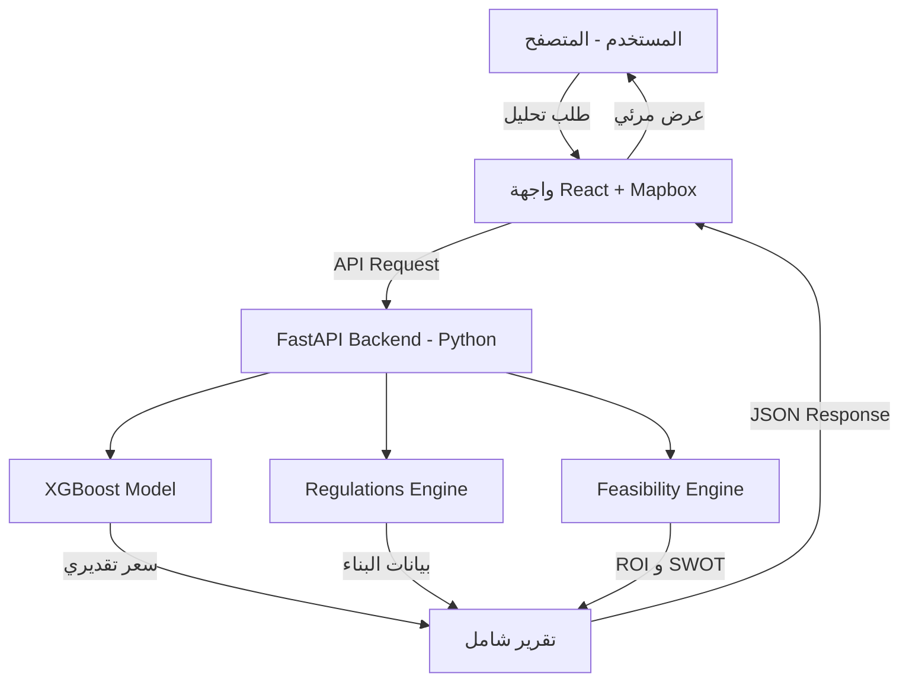

# التوثيق التقني الشامل لمنصة تقرير AI (Taqreer AI)

هذا المستند يشرح الهيكلية التقنية، الخوارزميات المستخدمة، والمكونات البرمجية التي تم بناء المنصة عليها حتى الآن.

---

## 1. الذكاء الاصطناعي ومودل التقييم (AI & Valuation Model)

### الخوارزمية المستخدمة: **XGBoost (Extreme Gradient Boosting)**
تم اختيار **XGBoost** لأنه الأقوى حالياً في التعامل مع البيانات الجدولية (Tabular Data) والعقارية، حيث يتميز بدقة عالية وقدرة على فهم العلاقات المعقدة بين المتغيرات.

#### كيف يعمل المودل؟
يتم تدريب المودل على آلاف الصفقات العقارية الحقيقية في مدينة جدة. المتغيرات (Features) التي يعتمد عليها المودل حالياً:
1. **الحي (Neighborhood):** يتم تحويله رقمياً عبر `LabelEncoder`.
2. **نوع العقار (Property Type):** (أرض، شقة، إلخ).
3. **المساحة (Area):** المساحة بالمتر المربع.
4. **المخطط (Plan):** (تمت إضافته حديثاً لزيادة الدقة).
5. **المؤشرات الزمنية (Time Features):** السنة والشهر لاستيعاب التغيرات الموسمية.

### نظام التنبؤ المستقبلي: **CAGR (Compound Annual Growth Rate)**
بدلاً من التنبؤ العشوائي، نستخدم **معدل النمو السنوي المركب** المخصص لكل حي:
- يقوم النظام بتحليل تريند الأسعار في كل حي على مدار السنوات الماضية.
- يتم حساب نسبة نمو حقيقية (مثلاً حي الشاطئ 15%، حي الحمدانية 5%).
- يتم تطبيق هذه النسبة على السعر الحالي لتوقع السعر بعد سنة بدقة رياضية.

---

## 2. المحركات الذكية (Intelligence Engines)

المنصة لا تكتفي بالسعر فقط، بل تقوم بتحليل عميق عبر محركين أساسيين:

### أ) محرك اشتراطات البناء (Regulations Engine)
- **الخوارزمية:** نظام قواعد منطقية (Rule-based System).
- **الوظيفة:** يربط موقع الأرض بقاعدة بيانات أنظمة أمانة جدة وكود البناء السعودي.
- **المخرجات:** يخبر المستخدم بـ (عدد الأدوار المسموحة، نسبة البناء، الارتدادات، الاستخدام المسموح).

### ب) محرك الجدوى المالية (Feasibility Engine)
- **الوظيفة:** محاكاة استثمارية كاملة.
- **الحسابات:**
    - **تكلفة المشروع:** (سعر الأرض + تكلفة البناء + رسوم التراخيص + احتياطي الطوارئ).
    - **الإيرادات:** (متوسط الإيجارات المتوقع في الحي × مساحة البناء × نسبة الإشغال).
    - **مؤشرات الأداء:** حساب **ROI** (العائد على الاستثمار) و **Payback Period** (فترة استرداد رأس المال).

---

## 3. الواجهة الأمامية وتجربة المستخدم (Frontend & UX)

### التقنيات المستخدمة:
- **React.js + Vite:** لضمان سرعة فائقة في التصفح.
- **Mapbox GL JS:** محرك الخرائط العالمي، المستخدم لعرض صور الأقمار الصناعية بدقة عالية وتحديد قطع الأراضي.
- **Tailwind CSS:** لتصميم واجهة عصرية "Dark Mode" تعطي إحساساً بالفخامة والاحترافية.
- **Framer Motion:** للأنيميشن والتعامل السلس مع لوحات البيانات.

### الميزات الذكية في الواجهة:
1. **الخريطة التفاعلية:** تتيح للمستخدم النقر على أي مكان في جدة، ويقوم النظام تلقائياً بالتعرف على الحي وإحداثيات الموقع.
2. **نظام التبويبات (Tabs):** تقسيم التقرير لسهولة القراءة (تقييم -> أنظمة -> جدوى).
3. **تحليل SWOT الآلي:** يقوم النظام بتوليد نقاط القوة والضعف والفرص والتهديدات للموقع المختار آلياً بناءً على الأرقام.

---

## 4. هيكلية النظام (System Architecture)

---

## 5. ما تم إنجازه حتى الآن (Status Summary)

1. **الأساس التقني:** بناء الـ Backend بالكامل بـ Python والـ Frontend بـ React.
2. **مودل التقييم:** تدريب المودل على بيانات جدة الحقيقية وحفظه بصيغة `.pkl`.
3. **التكامل مع الخريطة:** ربط الخريطة بالـ API لتمرير البيانات بمجرد النقر.
4. **الذكاء الاستثماري:** برمجة معادلات ROI و SWOT الآلية التي تحول البيانات الجامدة إلى نصائح استثمارية.

هذا النظام يضعك في مرحلة متقدمة جداً كمنصة **PropTech** احترافية تتجاوز مجرد "توقع أسعار" إلى "مستشار عقاري ذكي".
